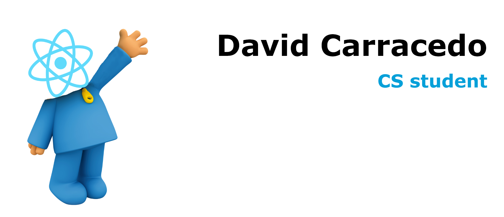

## Hi, I'm David 👋

    

I'm David Carracedo and I'm studying last course of CS. Feel free to take a look to my profile or contact me.

### Abstract

-   🎓 Currently studying Computer Science.
-   💙 Tech I like: **React, Java, Node.js, Docker, C and MySQL**.
-   🖥️ Interests: **Microservices infraestructure, Deep learning and Web development**.

    
    

